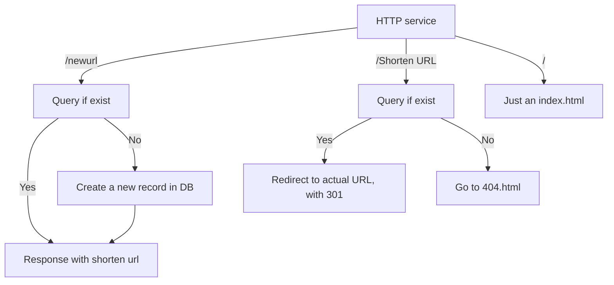

# Url shortener

## Workflow

## Technology stack
[_Flask_](https://flask.palletsprojects.com/en/1.1.x/) is a popular web micro-framework for building web applications with _Python_, whereas [_MongoDB_](https://www.mongodb.com/) is a [NoSQL](https://en.wikipedia.org/wiki/NoSQL) cross-platform document-oriented database program.

This project is going to use [Docker](https://www.docker.com/) with [docker-compose](https://docs.docker.com/compose/) in order to deploy our application, as well as make it easy for us to migrate our URL Shortener to other systems/devices.

Containers are allowed to communicate with other containers or with the host operating system through Docker daemon sockets, controlled by the Docker Engine.

## Deploy and run
To run the program:

    $ git clone https://github.com/Kiichi77/1OQBjgJkP
    $ cd 1OQBjgJkP
    $ sudo docker-compose up -d
Just a while your program will listen TCP port 5000 as http protocol.
## Example
### To create a shorten URL

    $ curl --header "Content-Type: application/json" --data '{"url":"http://google.com.hk"}' --request POST http://127.0.0.1:5000/newurl
    {url=http://google.com.hk, shortenUrl=http://test.kiichi7.com:5000/LbFfJD0FS}
    
    $ curl --header "Content-Type: application/json" --data '{"url":"https://www.google.com.hk"}' --request POST http://127.0.0.1:5000/newurl
    {url=https://www.google.com.hk, shortenUrl=http://test.kiichi7.com:5000/1OQBjgJkP}

### Visit a shorten URL

     curl http://test.kiichi7.com:5000/1OQBjgJkP -v
    *   Trying 127.0.0.1...
    * TCP_NODELAY set
    * Connected to test.kiichi7.com (127.0.0.1) port 5000 (#0)
    > GET /1OQBjgJkP HTTP/1.1
    > Host: test.kiichi7.com:5000
    > User-Agent: curl/7.58.0
    > Accept: */*
    >
    * HTTP 1.0, assume close after body
    < HTTP/1.0 301 MOVED PERMANENTLY
    < Content-Type: text/html; charset=utf-8
    < Content-Length: 257
    < Location: https://www.google.com.hk
    < Server: Werkzeug/1.0.1 Python/3.8.5
    < Date: Tue, 04 May 2021 14:25:16 GMT
    <
    <!DOCTYPE HTML PUBLIC "-//W3C//DTD HTML 3.2 Final//EN">
    <title>Redirecting...</title>
    <h1>Redirecting...</h1>
    * Closing connection 0
    
You should be redirected automatically to target URL: <a href="https://www.google.com.hk">https://www.google.com.hk</a>.  If not click the link.

## Configurate the webapp

Configurations are stored in [docker-compose.yml](https://github.com/Kiichi77/1OQBjgJkP/blob/master/docker-compose.yml).
|Item|Comment  |
|--|--|
|BASEURL|The domain name for the webapp, you should include the port you would like to let the app listening.  |
|MONGO_INITDB_DATABSE|Name of database to store the shorten url list. (It should be the same in the 'webapp' and 'db' section.)|
|MONGO_INITDB_ROOT_USERNAME|Username to access the database. (It should be the same in the 'webapp' and 'db' section.)|
|MONGO_INITDB_ROOT_PASSWORD|Password to access the database. (It should be the same in the 'webapp' and 'db' section.)|
